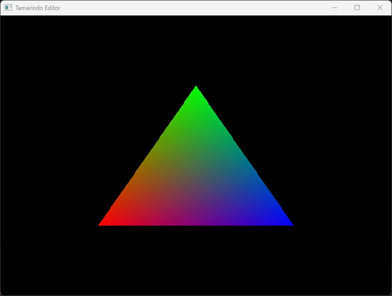

# Tamarindo Engine

This project is a work in progress toy rendering engine for Windows. The project is written in C++17, and uses DirectX11 as rendering framework.

The main goal of this project is to learn about rendering techniques, graphic APIs, resources management, and overall system design withing graphics programming.

 

## Building the project

This project requires:

- Visual Studio 2022.
- vcpkg (not needed if using Visual Studio 2022 version 17.6+).

If you use VS2022 version 17.6+, the solution will build out of the box. Otherwise, you are required to manually install the vcpkg dependencies from `vcpkg.json`.

# Next improvements

* Better API for application code
* Scene-based projects
* Resource management
* ImGui based UI
* Support different frameworks (DirectX12, Vulkan)
* Advanced shading and lighting techniques
