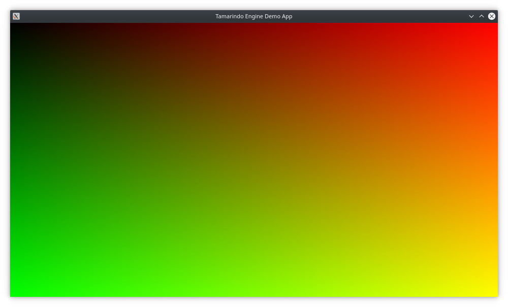

# Tamarindo Engine

This project is a work in progress toy rendering engine written in modern C++ and OpenGL as rendering framework.

The main goal of this project is to learn about rendering techniques, graphic APIs, resources management, and overall system design withing graphics programming.

## Current status

The engine static library can be used to create a graphical applications and render meshes. Currently, the application creates a Scene with a single root game object, and a camera. The game object can load a Model from a [glTF](https://www.khronos.org/gltf/) file.

The API is a work-in-progress. The engine library is not meant to be yet usable by other applications.

|                                               |
|:----------------------------------------------------------------:|
| 3D asset from: [kenney.nl](https://www.kenney.nl/assets/car-kit) |

## Building the project

 First, get the code by cloning this repository and the third party submodules:

```
git clone --recurse-submodules git@github.com:eariassoto/tamarindo_engine.git
```

This project uses Premake to generate the build files. After executing Premake, the folder `generated/<target>` will be created will all the build files for the specified target. If the project compiles successfully, the executable will get saved in `generated/<target>/output`.

For Windows, the project has been tested in VS2019 and VS2022. Use the script files `scripts/build_vs19.bat` and `scripts/build_vs22.bat` create the respective solution files.

For Linux there is also a script file. Use `scripts/build_project.sh` to create Makefiles. You will need to have `make` installed to compile the project. For example, to compile the project in Debug mode for x64 targets run:

```
$> ./scripts/build_project.sh
$> cd generated/gmake
$> make config=debug_x64 -j4 tamarindo_editor
```

And to run the executable:

```
> ./output/game_app/Debug-x86_64/tamarindo_editor
```

# Next improvements

* Better API for application code
* Scene-based projects
* Resource management
* ImGui based UI
* Support different frameworks (DirectX, Vulkan)
* Advanced shading and lighting techniques
